# MARSCOPE — System Architecture

**MARSCOPE** is engineered as a high-performance, zero-cost planetary exploration and EVA mission planning workstation. The system adheres to the core philosophy:

$$\text{MAP} \longrightarrow \text{DATA} \longrightarrow \text{ANALYSIS} \longrightarrow \text{DECISION}$$

---

## 1. Architectural Overview

```mermaid
flowchart TD
    subgraph UI_Layer ["Presentation Layer (Next.js 15 & Tailwind CSS)"]
        TOP["TopBar & Region Jump"]
        MAP2D["2D Cartographic Workstation (Leaflet / IAU EPSG:4326)"]
        GLOBE3D["3D Mars Globe & MOLA Heightfield (Three.js WebGL)"]
        INSPECT["Location Inspector Panel"]
        ROUTER["EVA Traversal Planner Panel"]
        COMPARE["Route Comparison Modal"]
        ELEV["Topographic Elevation Cross-Section Chart"]
        BRIEF["NASA EVA Mission Brief Generator"]
        NLP["Ask MARSCOPE (Natural Language Agent)"]
    end

    subgraph Scientific_Core ["Scientific & Mathematical Computation Core"]
        GEODESY["Planetary Geodesy Engine (mars-coordinates.ts)"]
        MOLA["MOLA DEM & Gradient Analysis (mola-data.ts)"]
        SCIENCE["Science & CRISM Registry (science-data.ts)"]
        ASTAR["Multi-Objective A* Pathfinding Solver (pathfinding.ts)"]
        PLSS["PLSS Life Support Consumables Model (mission-brief.ts)"]
    end

    subgraph Data_Layer ["Data Provenance Layer (NASA / USGS)"]
        MOLA_DATA["MGS MOLA MEGDR Topography (463m/pixel)"]
        CRISM_DATA["MRO CRISM Hyperspectral Mineral Signatures"]
        HIRISE_DATA["MRO HiRISE / CTX Context Mosaics"]
        VIKING_DATA["USGS Astrogeology Viking MDIM 2.1 Mosaic"]
    end

    MOLA_DATA --> MOLA
    CRISM_DATA --> SCIENCE
    HIRISE_DATA --> SCIENCE
    VIKING_DATA --> MAP2D

    GEODESY --> MOLA
    MOLA --> ASTAR
    SCIENCE --> ASTAR
    ASTAR --> ROUTER
    ASTAR --> COMPARE
    ASTAR --> ELEV
    ASTAR --> GLOBE3D
    ASTAR --> BRIEF
    PLSS --> BRIEF

    MOLA --> INSPECT
    SCIENCE --> INSPECT
    MOLA --> GLOBE3D

    TOP --> MAP2D
    TOP --> GLOBE3D
    NLP --> ASTAR
    NLP --> MOLA
```



---

## 2. Component Structure

```
/src
├── app/
│   ├── globals.css           # Dark Martian palette, HUD styling, Leaflet overrides
│   ├── layout.tsx            # Root metadata and responsive viewport
│   └── page.tsx              # Main mission workstation coordinating state & panels
├── components/
│   ├── globe/
│   │   └── MarsGlobe3D.tsx   # Three.js 3D globe & local MOLA heightfield mesh (1x, 2x, 5x)
│   ├── layout/
│   │   ├── BottomBar.tsx     # Real-time coordinates, elevation, slope, and data source status
│   │   ├── LandingHero.tsx   # Minimal NASA Space Apps entry hero
│   │   └── TopBar.tsx        # Brand, region selector, 2D/3D mode switch, modal triggers
│   ├── map/
│   │   └── MarsMap2D.tsx     # Leaflet 2D cartographic workstation with NASA/USGS tiles
│   └── panels/
│       ├── AskMarscopeModal.tsx   # Natural language deterministic query assistant
│       ├── DataSourcesModal.tsx   # Complete NASA/USGS dataset registry & attribution
│       ├── ElevationChartModal.tsx# Interactive SVG elevation profile cross-section
│       ├── LayerControl.tsx       # Basemap imagery selector & scientific layer toggles
│       ├── LocationInspector.tsx  # Telemetry inspector: elevation, slope, TRI, science score
│       ├── MissionBriefModal.tsx  # NASA-style EVA mission brief with PLSS consumables
│       ├── RouteComparisonPanel.tsx # Side-by-side comparison of Safest, Fastest, and Science
│       └── RoutePlannerPanel.tsx  # Traversal setup, strategy selector, and route metrics
├── lib/
│   ├── mars-coordinates.ts   # IAU planetocentric geodesy, Haversine, bearing, azimuth
│   ├── mars-textures.ts      # Client-side photorealistic Mars albedo and bump textures
│   ├── mission-brief.ts      # Mission brief generator and life-support margin calculator
│   ├── mola-data.ts          # MOLA DEM grids, bilinear interpolation, finite slope, TRI
│   ├── nlp-query.ts          # Deterministic query engine for coordinates, regions, and layers
│   ├── pathfinding.ts        # Multi-objective A* graph solver over Martian DEM
│   └── science-data.ts       # NASA science points, CRISM minerals, explainable scoring
└── __tests__/
    └── marscope-core.test.ts # Vitest unit test suite (14 passing tests)
```

---

## 3. High-Performance Design & Offline Demo Resilience

1. **Client-Side Synthesis**: Three.js planetary textures and bump maps are synthesized client-side via HTML5 canvas, consuming 0 KB of network bandwidth and preventing external CDN failures.
2. **Pre-Sampled MOLA Grids**: High-resolution digital elevation matrices for the 5 key Martian exploration zones (Jezero Crater, Olympus Mons, Melas Chasma, Gale Crater, and Planum Australe) are bundled in the client bundle. This allows real-time bilinear elevation queries ($< 0.1\text{ ms}$) and instant A* graph solves without server roundtrips.
3. **Dynamic Import Guards**: Leaflet and Three.js are dynamically imported with `ssr: false` to eliminate server-side rendering mismatches while preserving sub-second initial hydration.
